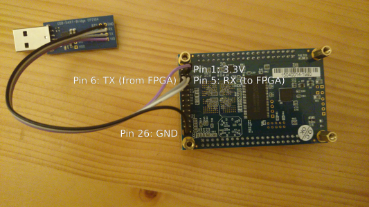

## Prerequisites

#### System

 * An x86 Linux workstation
 * The `curl` command line utilities
 * OpenOCD
 * The quartus FPGA design software
 * `fusesoc` - The [FuseSoC build system](../fusesoc.html).
 * `or1k-elf-` Toolchain as installed in our [newlib tutorial](../../toolchains/newlib.html).

#### Files

 * [hello.c](../../../resource/de0_nano/sw/hello/hello.c) - A Hello World test program.
 * [timer.c](../../../resource/de0_nano/sw/timer/timer.c) - A baremetal example using the OpenRISC timer api's provided by newlib.

## DE0 Nano

To confirm you have all of the required tools installed check with the following:

To run the demo you need:

* `quartus_pgm` in your `PATH`, check with

        which quartus_pgm

* `openocd` in your `PATH` and `OPENOCD` set, check with

        openocd --version
        echo $OPENOCD

* `or1k-elf-gdb` in your `PATH`, check with

        or1k-elf-gdb --version

### Setup the board

First you need to setup the board, by connecting the USB cable to your
computer. If you want to use UART, an extra dongle is needed. Any
USB-UART adapter can be used. You need to connect it to the header on
the bottom of the board as depicted below.



### Setup the Environment

To get started we will want to have a directory with all
of our build files in one place.

```bash
mkdir /tmp/or1k-de0nano
cd /tmp/or1k-de0nano

curl -L -O https://openrisc.io/tutorials/sw/hello/hello.c
curl -L -O https://openrisc.io/tutorials/sw/timer/timer.c

CFLAGS="-mboard=de0_nano -DDE0_NANO"
or1k-elf-gcc -g -Og $CFLAGS -o hello.elf hello.c
or1k-elf-gcc -g -Og $CFLAGS -o timer.elf timer.c

# Add IP cores to the environment
fusesoc library add fusesoc-cores https://github.com/fusesoc/fusesoc-cores
fusesoc library add elf-loader https://github.com/fusesoc/elf-loader.git
fusesoc library add openrisc-cores https://github.com/openrisc/openrisc-cores
fusesoc library add de0_nano https://github.com/olofk/de0_nano.git

# Check the SoC is available
fusesoc core show de0_nano
```

### Build the FPGA bitstream

```bash
fusesoc run de0_nano
```

The FuseSoC `run` command will run the default target, for `de0_nano` this is
synthesis using the tool `quartus`.  You could also specify this using `fusesoc
run --target synth --tool quartus de0_nano`.  The `run` command has 3 phases:

  * **setup** - Creates the project directories and project files
  * **build** - Builds the artifacts, for quartus this means the FPGA bitstream.
  * **run** - Runs the SoC, this will perform programming, but by default this is disabled.

### Program the FPGA bitstream

Once the board is setup and built, you can download the FPGA bitstream by
running the following:

```bash
fusesoc run --run de0_nano --pgm quartus
```

Passing the `--run` argument allows only the run stage to be run. This is useful
as we do not want to build the entire project again.  Passing `--pgm quartus`
enables the run stage to use `quartus_pgm` to program the bitstream to fpga
board.

### Start the OpenOCD daemon

In one terminal execute the following command:

	openocd -s ${OPENOCD}/share/openocd/scripts/ -f interface/altera-usb-blaster.cfg -f ../or1k-dev.tcl

### Run software with gdb

From a second terminal you can now run gdb, for example to run the
timer example:

	or1k-elf-gdb timer.elf

In gdb execute the following steps:

	target remote :50001
	load
	set $npc=0x100
	continue

You should see the LEDs counting and UART output once a second.
